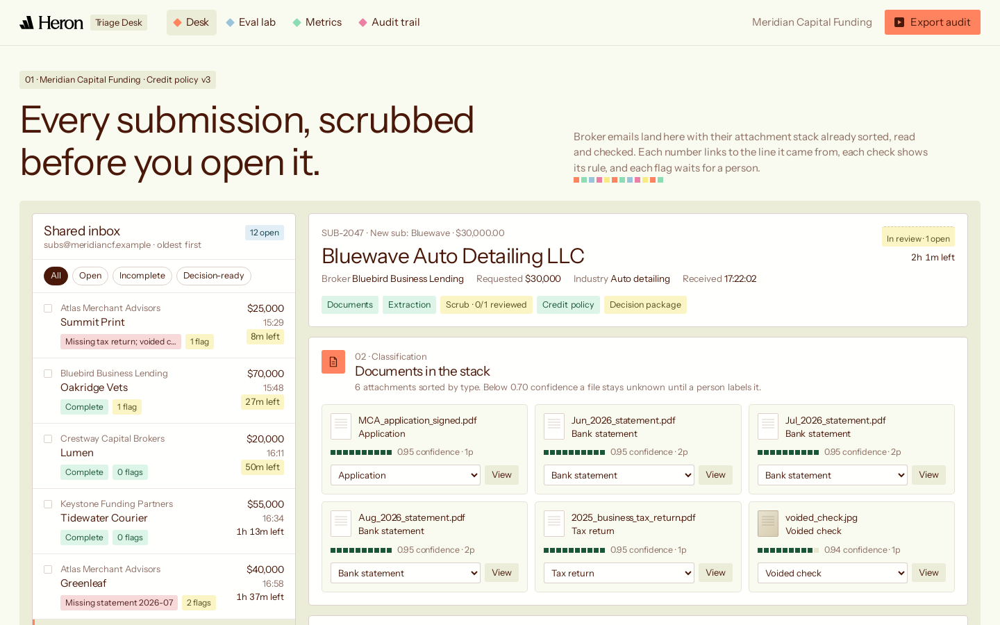
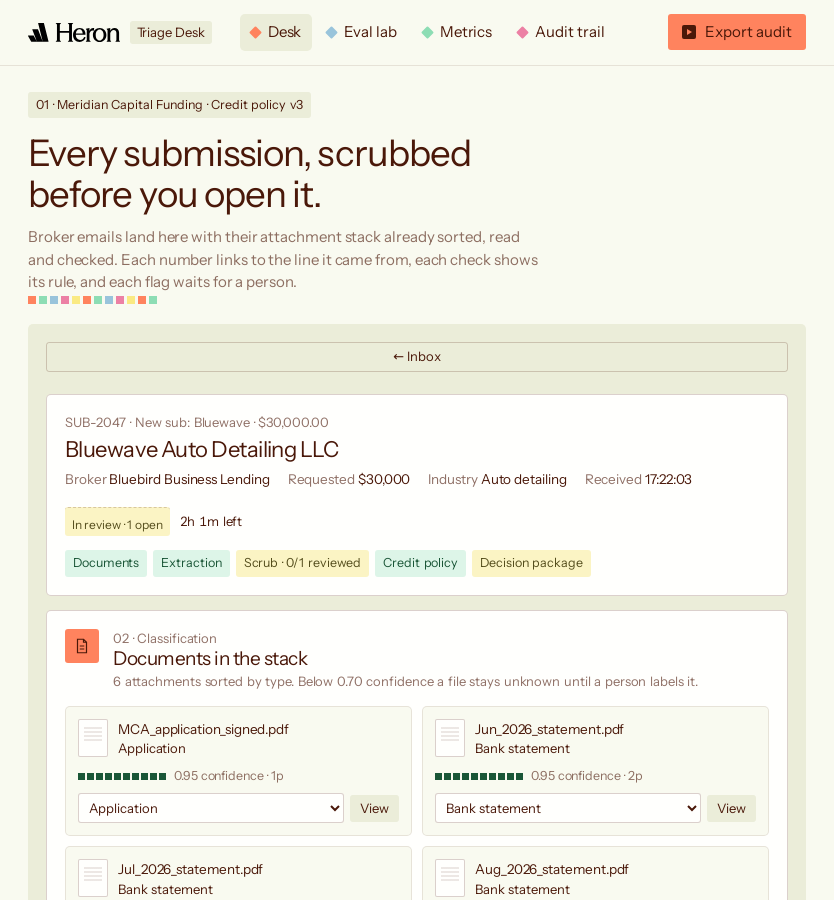
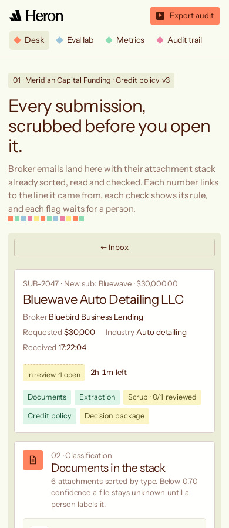
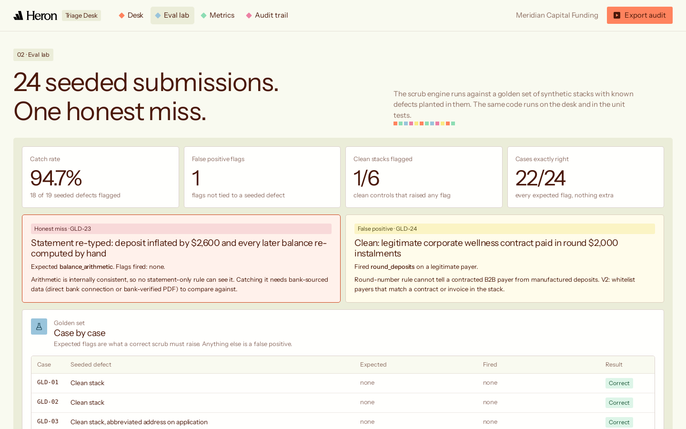
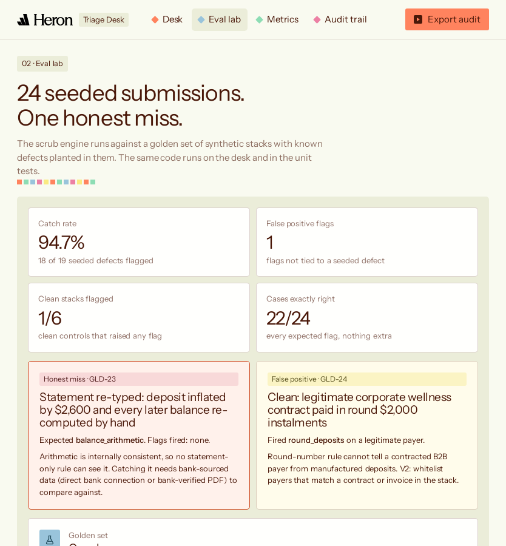
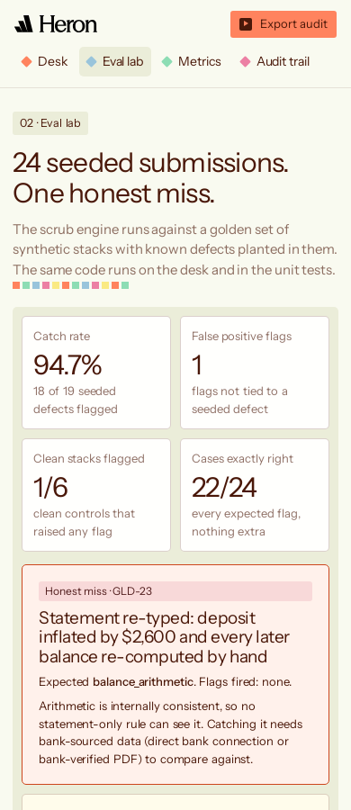

# Submission Triage Desk

**Live:** https://cashpointsoulja.github.io/heron-submission-triage-desk/  
**Demo video:** [`video/triage-desk-demo.mp4`](video/triage-desk-demo.mp4) (vertical, 1080×1920)

## ELI5

A small business wants funding. Its broker emails a funder a pile of PDFs and phone photos: an application, three bank statements, a tax return, a voided check. Before anyone can say yes or no, someone has to open every file, work out what it is, copy the numbers out, add up the bank balances to make sure nobody edited them, and check that the business name is the same on every page.

The Triage Desk does all of that the moment the email lands. When the underwriter opens the deal, every document is already labelled, every number has a little tag that jumps to the exact line it came from, and every check shows the rule it used. Anything suspicious is flagged for a person to decide. The computer never says yes on its own.

## The 30-second version

Underwriting teams at small business funders lose deals to speed. A submission sits in a shared inbox while someone sorts and scrubs it by hand. This concept extends Heron's intake and bank-statement scrubbing pipeline into the underwriter's working surface:

1. **Inbox**: shared-inbox queue with broker, business, ask, received time, completeness and a live SLA clock.
2. **Classification**: every attachment labelled with a confidence score; low-confidence files stay *unknown* until a person reclassifies them in one click, and every downstream check re-runs.
3. **Extraction with evidence chips**: legal name, EIN, monthly revenue, average daily balance, positions, each linked to the source document, page and line.
4. **Scrub engine**: 13 deterministic checks run as code (balance arithmetic, continuity, missing pages, NSF/overdraft/negative days, round-number deposits, concentration, pre-application deposits, name/address/EIN/owner consistency, position disclosure), each showing its rule and evidence.
5. **Evaluation rules**: the funder's credit box as explicit "Where … is at least …" rules with pass/fail and the reason.
6. **Review flow**: every flag must be confirmed or overridden with a rationale before the file can be marked decision-ready. Nothing auto-approves.
7. **Decision-ready package**: one CRM-style record, exportable as JSON or CSV.
8. **Audit trail**: every classification, extraction, check, rule, review and decision, timestamped and exportable.
9. **Eval lab**: 24 golden submissions with seeded defects. 18 of 19 caught, 1 false positive, and the honest miss shown on screen.
10. **Metrics**: time-to-decision (measured in-browser), scrub time saved (modelled, assumptions shown), first-pass completeness rate.

## Screenshots

| 1440 | 834 | 390 |
| --- | --- | --- |
|  |  |  |
|  |  |  |

## Run it

```bash
npm test          # 207 unit tests (rule engine + golden set), Node 20+
npm run evals     # golden-set report
npm run serve     # http://localhost:4173
```

No build step, no backend, no sign-in, no network calls. State (reviews, decisions, audit) lives in `localStorage`; *Reset demo* on the Audit page clears it.

## Repo map

| Path | What |
| --- | --- |
| `index.html`, `styles.css`, `src/app.js` | The desk UI |
| `src/generator.js` | Deterministic synthetic document stacks (pages, lines, structured data) |
| `src/engine.js` | Classification, extraction, scrub checks, credit policy |
| `src/scenario.js` | Meridian Capital Funding and its 12 live submissions |
| `src/golden.js`, `src/evals.js` | 24 seeded golden cases and the scorer |
| `tests/` | 207 unit tests |
| `design/` | Brand capture done before any product code: `BRAND.md`, `VISUAL-GUIDE.md`, screenshots, logo assets |
| `video/` | Demo video and timed script |

## PM docs

[PRD](PRD.md) · [Five whys](FIVE-WHYS.md) · [Jobs to be done](JTBD.md) · [Metrics](METRICS.md) · [Test plan](TEST-PLAN.md) · [Test results](TEST-RESULTS.md) · [Evals](EVALS.md) · [Viability](VIABILITY.md) · [Roadmap V2](ROADMAP-V2.md)

## Honesty notes

- Every business, broker, person and document is synthetic. Meridian Capital Funding does not exist.
- The documents are already-digital text. Real submissions are scans and phone photos; OCR quality is the hardest part of the real problem and is out of scope here (see [VIABILITY.md](VIABILITY.md)).
- Pain points and time savings are hypotheses built from public descriptions of the workflow, not measurements from any Heron customer.
- Heron's logo and colours are used to show how the concept would sit inside their product. Fonts: Heron uses the commercial Season family; this build ships Instrument Sans (SIL OFL) as the closest open substitute.

---

Independent concept by Ayo Ahmed. Not affiliated with Heron.
