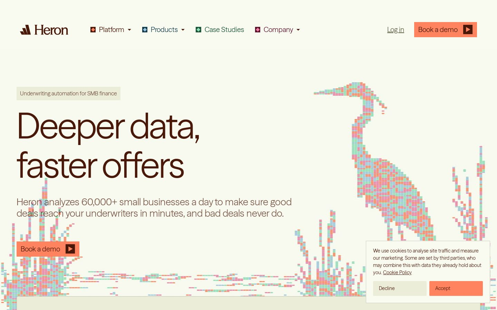
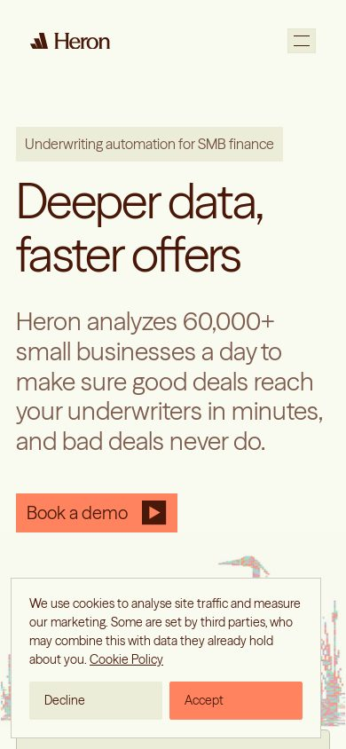
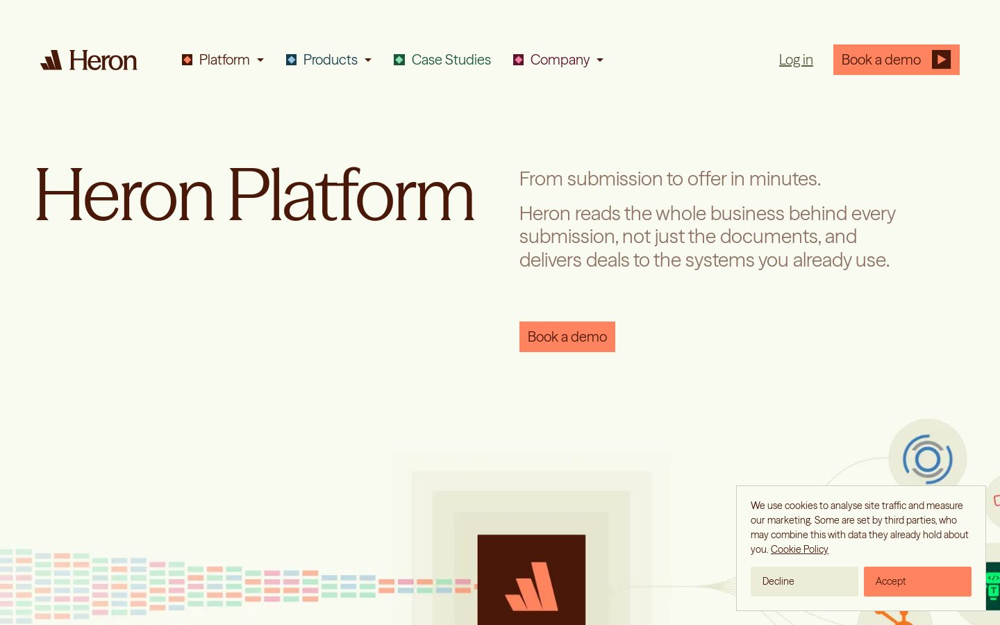
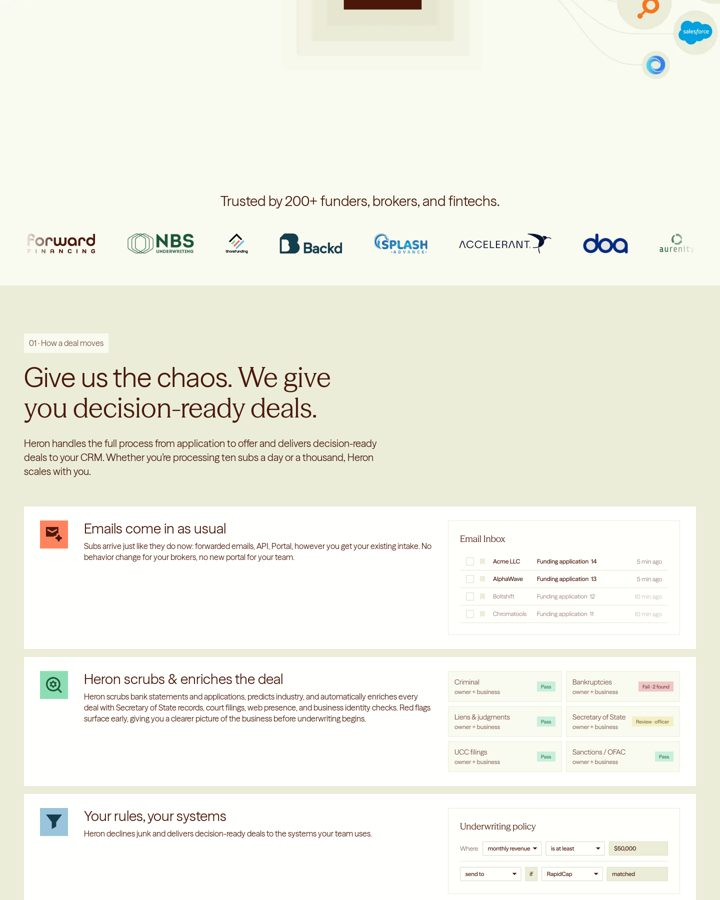
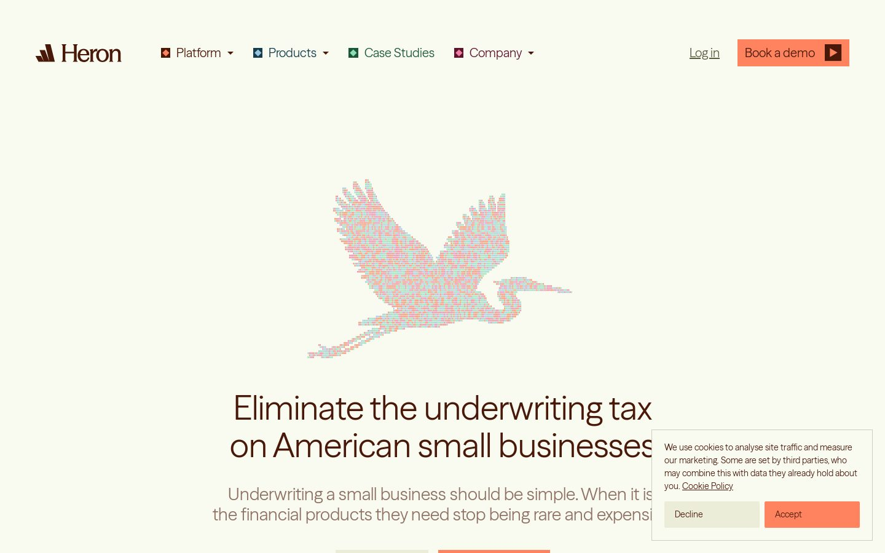
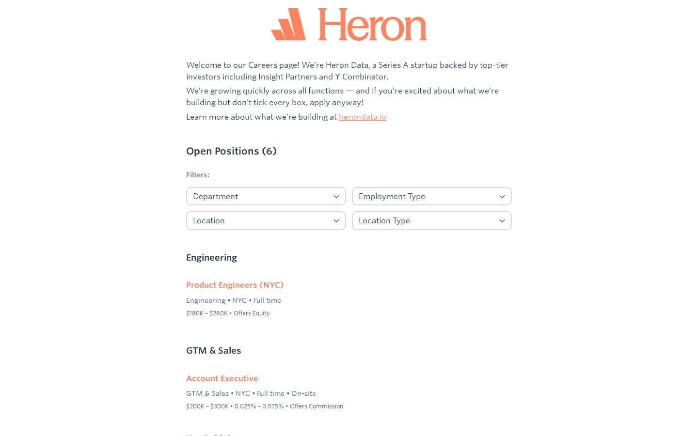

# Visual guide: how the desk mirrors Heron

Reference captures (1440px and 390px) taken from the live site:

| Capture | What it shows |
| --- | --- |
|  | Nav: logo left, square colour-coded nav icons, text link "Log in", tangerine "Book a demo" with dark play square. Eyebrow chip on olive-200. Huge light display headline. |
|  | Mobile: logo left, olive square hamburger; headline wraps to two lines; full-width button. |
|  | Two-column hero: display title left, muted sub copy right. |
|  | The product-UI vocabulary: olive-200 band, near-white cards with a coloured square icon tile, mini UI mocks inside (email inbox rows, check grid with Pass / Fail / Review badges, "Underwriting policy" rule builder with Where / is at least / send to). |
|  | Pixel-block heron artwork in tangerine, green, blue and pink. |
|  | Careers page layout. |

## Patterns adopted in the desk

1. **App shell** = Heron's nav. Logo top-left at the same scale, nav items each preceded by a 10px rotated-square icon in its category colour (tangerine, blue, green, pink), a right-aligned muted text link and a tangerine primary button.
2. **Eyebrow chips** ("01 · Inbox") in olive-200 with small brown text above each section title.
3. **Section band + cards**: screens sit on olive-200 bands; work surfaces are near-white cards with 1px 20% border and 5px radius, each headed by a coloured square icon tile (as in "Emails come in as usual").
4. **Inbox rows** copy the "Email Inbox" mock: checkbox, sender, subject, right-aligned muted time.
5. **Check grid** copies the scrub mock: two-line cell (check name over "owner + business"-style scope) with a right-aligned badge: green Pass, red Fail · n found, yellow Review.
6. **Policy rules** copy the "Underwriting policy" builder: "Where [field] [is at least] [value]" rows with olive inputs.
7. **Pixel blocks**: small four-colour block strips used as a quiet decorative divider and as confidence bars.
8. **Type**: light 400-weight headings with negative tracking; no bold; muted 60% brown for secondary text.
9. **Buttons**: primary tangerine with brown text and a dark square glyph; secondary olive-200.

Footer on every screen: "Independent concept by Ayo Ahmed. Not affiliated with Heron."
